<div align="center">

# 🕹️ Spooky Game

### A 3D survival horror game — wake up in a haunted mansion and find a way out

[](./Spooky%20Game.exe)
[](https://aryalunawatgames.itch.io/spookygame)
[](#-about)
[](#-about)

[About](#-about) · [Features](#-features) · [Screenshots](#-screenshots) · [Platforms](#-platforms) · [Getting Started](#-getting-started) · [Roadmap](#-roadmap)

**[🎮 Play on itch.io](https://aryalunawatgames.itch.io/spookygame)**

</div>

---

## 🎯 About

Lost in a dense jungle, you stumble upon a mysterious abandoned mansion hidden deep within the trees. As you reach the rusted gate, everything suddenly goes black. Moments later, you wake up inside the haunted house — and every step draws you deeper into its dark secrets, where terrifying creatures and unimaginable horrors await.

There is only one goal now: **find a way out before the house claims you forever.**

---

## ✨ Features

- 🌲 Atmospheric forest-to-mansion opening sequence that sets up the story
- 🏚️ Multi-level haunted house with distinct rooms to explore across Level 1 and Level 2
- 🧟 Zombie and maze-monster encounters blending survival and shooter mechanics
- 🔫 Ammunition pickups to manage as you fight your way through
- 🧩 Puzzle elements (including an eye puzzle) gating progression through the mansion
- 🎧 Single-player horror experience built for immersion

**Tags:** `Survival` · `Puzzle` · `Shooter` · `3D` · `Horror` · `Monsters` · `Singleplayer` · `Zombies`

---

## 📱 Screenshots

### The Descent

<table>
  <tr>
    <td align="center"><b>The Forest</b></td>
    <td align="center"><b>The Haunted House</b></td>
  </tr>
  <tr>
    <td>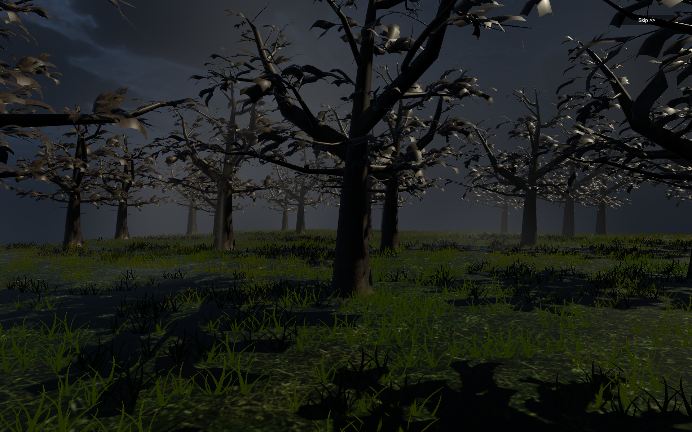</td>
    <td>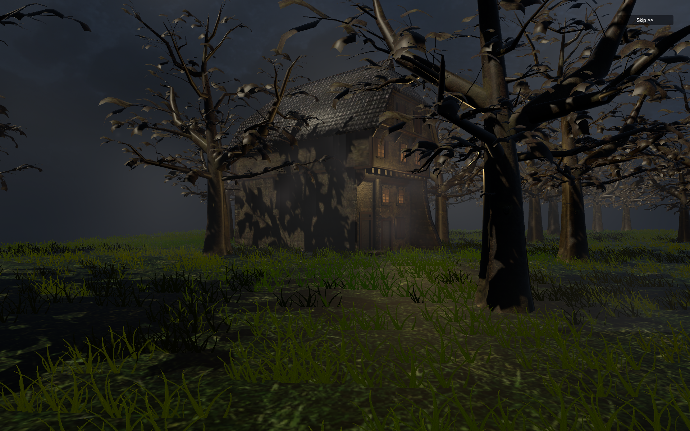</td>
  </tr>
</table>

### Level 1

<table>
  <tr>
    <td align="center"><b>Level 1 Room</b></td>
    <td align="center"><b>Ammunition Pickup</b></td>
  </tr>
  <tr>
    <td>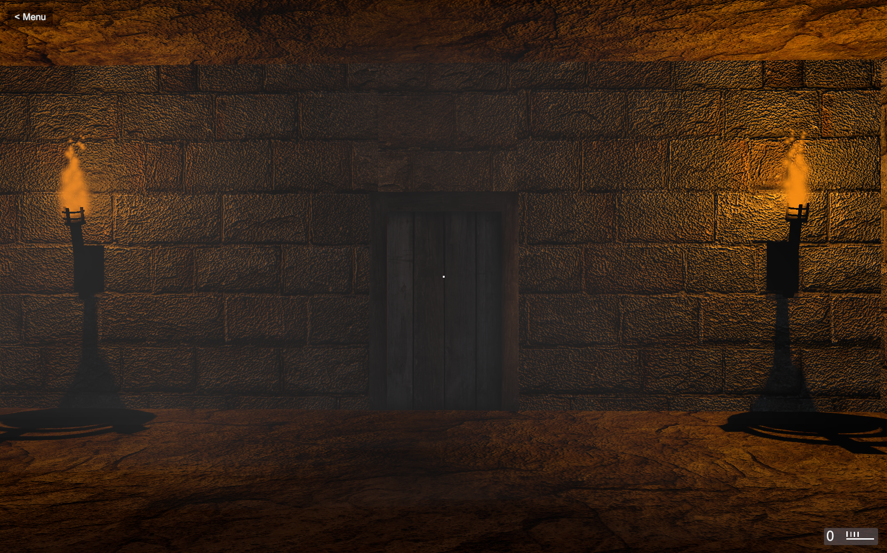</td>
    <td>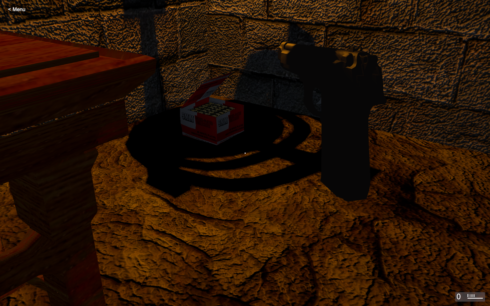</td>
  </tr>
</table>

### Level 2

<table>
  <tr>
    <td align="center"><b>Level 2, Room 1</b></td>
    <td align="center"><b>Level 2, Room 2</b></td>
  </tr>
  <tr>
    <td>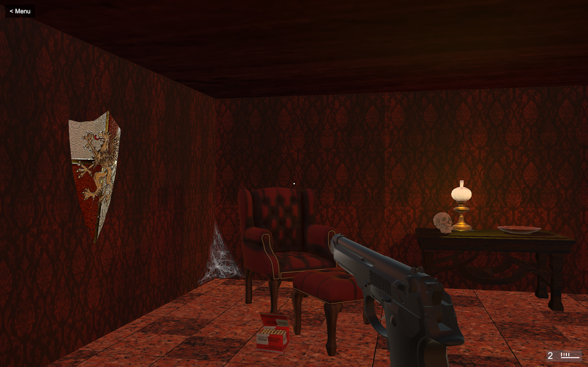</td>
    <td>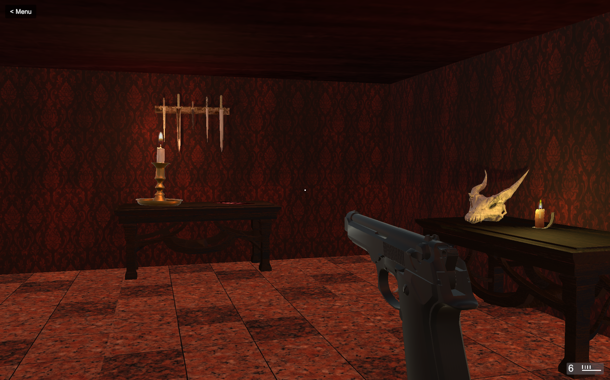</td>
  </tr>
</table>

<table>
  <tr>
    <td align="center"><b>Pottery Room</b></td>
    <td align="center"><b>"Get Out" Graffiti</b></td>
  </tr>
  <tr>
    <td>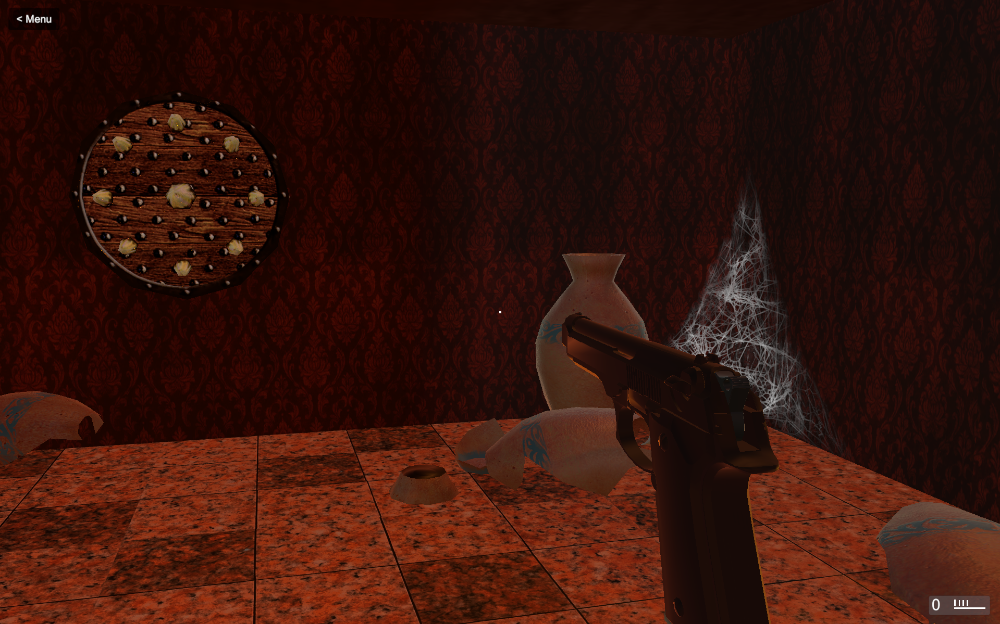</td>
    <td>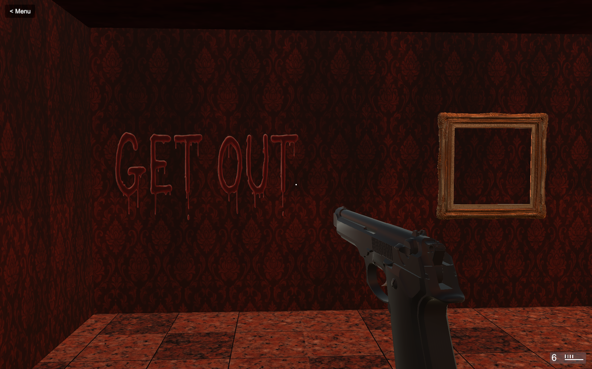</td>
  </tr>
</table>

<table>
  <tr>
    <td align="center"><b>Zombie Encounter I</b></td>
    <td align="center"><b>Zombie Encounter II</b></td>
  </tr>
  <tr>
    <td>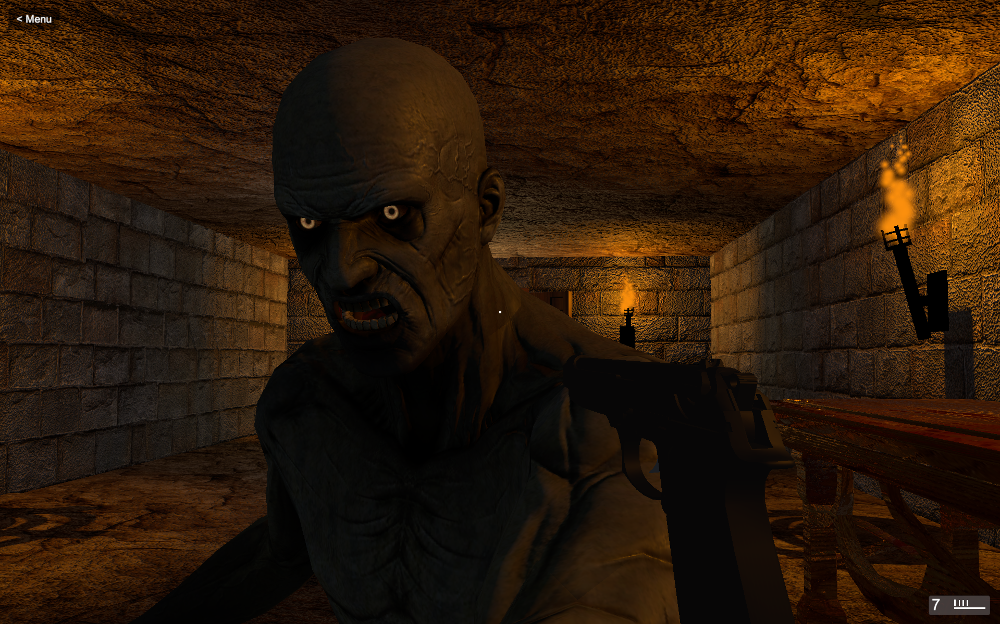</td>
    <td>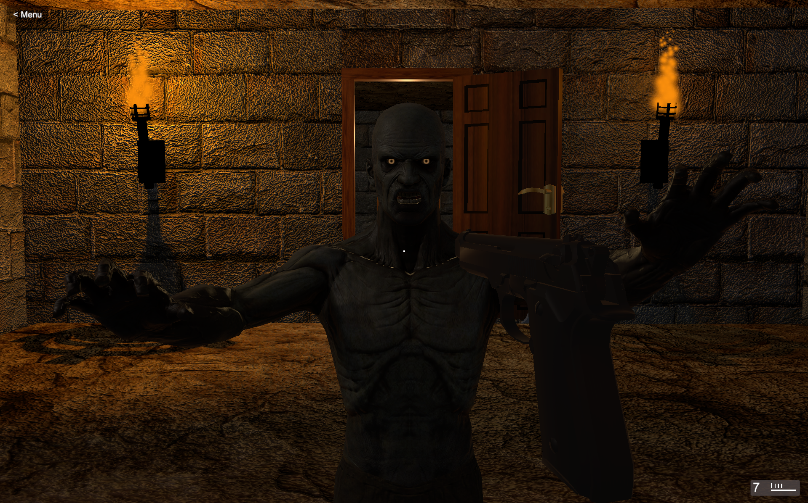</td>
  </tr>
</table>

### Puzzles & Enemies

<table>
  <tr>
    <td align="center"><b>Maze Monster</b></td>
    <td align="center"><b>Eye Puzzle</b></td>
  </tr>
  <tr>
    <td>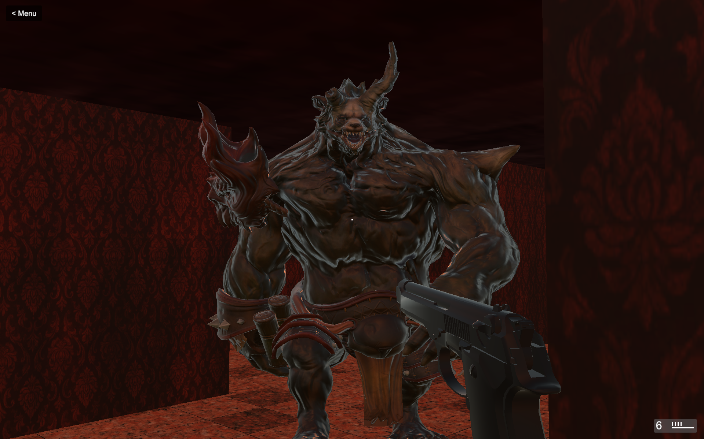</td>
    <td>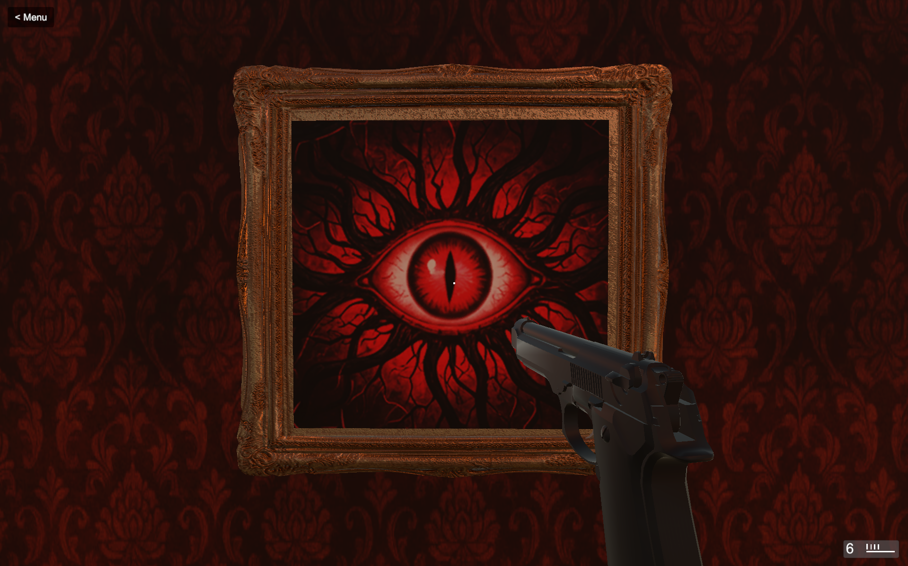</td>
  </tr>
</table>

---

## 🕹️ Platforms

| Platform | Access |
|---|---|
| HTML5 (Browser) | [Play on itch.io](https://aryalunawatgames.itch.io/spookygame) |
| Windows | Download [`Spooky Game.exe`](./Spooky%20Game.exe) from this repo |

---

## 🚀 Getting Started

### Play instantly (no install)
Head to the [itch.io page](https://aryalunawatgames.itch.io/spookygame) and click **Run Spooky Game**.

### Run locally (Windows)
```bash
git clone https://github.com/arya-lunawat/SpookyGame.git
cd SpookyGame
```
Then run `Spooky Game.exe`.

> ⚠️ As an unsigned indie build, Windows SmartScreen may flag it on first launch — this is expected for small, self-published games and not a sign of malicious content.

---

## 👨‍💻 Author

**Arya Lunawat** <br>
MBA Tech | NMIMS Indore

[](https://github.com/arya-lunawat)
[](https://aryalunawatgames.itch.io)

---

<div align="center">
  <sub>Built as a 3D survival horror project</sub>
</div>
